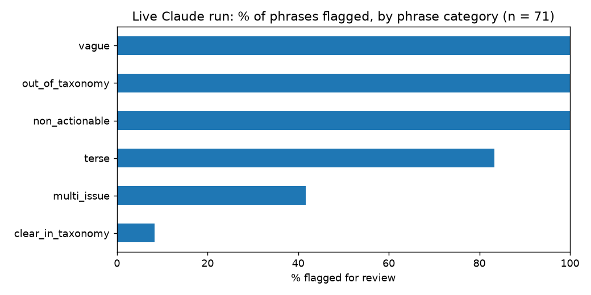

# EvalOps Flag-Log Analysis

A SQL + Python analysis of the "flag for review" rules in a recommender service I worked on in a summer 2026 research project (EvalOps, with NC State's Laboratory for Analytic Sciences). The service takes free-text feedback about an AI system, has Claude classify it against a fixed taxonomy (7 task types, 8 problem types), recommends evaluation metrics, and **flags** weak classifications for human review using four signals: no task/problem label, a tiny metric bundle (fewer than 2), a low-detail summary, and the model's own self-reported low confidence.

**Question:** which kinds of feedback does the flagger send to review, and why?

## Read this first: what the data is

| Dataset | n | What it is |
|---|---|---|
| **Live run** (`data/run_real_claude.jsonl`) | 72 phrases, 71 results + 1 pipeline error | **Real Claude API output**, model `claude-sonnet-5-5`, run 2026-09-29 through the recommender's own classify → recommend → flag functions |
| Legacy log (`data/flagged_feedback.jsonl`) | 9 records | 5 seeded demo fixtures + 4 output of the recommender's `DEV=true` keyword mock. **Not model output.** Kept only as a labeled side note (`data/provenance.csv` has the evidence per record) |

**The 72 phrases are synthetic.** I wrote them (with AI help) as test inputs in six categories of 12: `clear_in_taxonomy`, `multi_issue`, `vague`, `out_of_taxonomy`, `non_actionable`, `terse` (`data/phrases.csv`). They are **not real user feedback**, and most were designed to be hard. So the overall flag rate below is a property of my test set, not an estimate for real users. Each phrase was run **once**; Claude's outputs can vary between runs.

**Model note:** the recommender hardcodes `claude-sonnet-4-20250514`, which the API now rejects (404). `src/run_recommender.py` swaps in `claude-sonnet-5-5` at call time without editing the recommender's source. Results describe that model with the recommender's prompt and rules.

## Method

1. `src/run_recommender.py` runs each phrase through the recommender's real functions with `DEV=false` (it refuses to run in mock mode), storing every result, flagged or not.
2. `src/load.py` loads the JSONL into SQLite: `records`, `flag_reasons` (one row per reason), `record_labels` (one row per chosen label), `run_errors`.
3. `sql/06…11_*.sql` analyze the live run (`GROUP BY`, `CASE WHEN`, joins, CTEs, `RANK() OVER`); `sql/01…05_*.sql` cover the legacy log.
4. `src/analyze.py` writes `outputs/*.csv` and charts. 6 pytest cases cover the loading.

## Results — live run (n = 71 results)

**Flag rate by phrase category (Q6):**

| Category | Phrases | Flagged | % flagged |
|---|---|---|---|
| vague | 12 | 12 | 100.0 |
| non_actionable | 12 | 12 | 100.0 |
| out_of_taxonomy | 11 | 11 | 100.0 |
| terse | 12 | 10 | 83.3 |
| multi_issue | 12 | 5 | 41.7 |
| clear_in_taxonomy | 12 | 1 | 8.3 |



- Overall 51 of 71 were flagged (71.8%) — driven by the test set's design (only 12 of 72 phrases were clear), so this is not a real-world rate.
- **Severity (Q6):** of the 51 flags, 50 were `high` and 1 was `low`; none `medium`.
- **The self-reported-confidence signal does almost all the work (Q7, Q8):** 50 of the 51 flags include `model_self_reported_low_confidence`; Claude rated 50 of 71 phrases (70%) low confidence, 12 medium, 9 high. Low confidence always flags by construction, so the informative rows are: 1 of 12 medium and 0 of 9 high-confidence results were flagged.
- **Signals overlap heavily (Q9):** 23 phrases had no labels at all and all 23 also reported low confidence; 27 more reported low confidence even though labels were assigned; 21 had neither signal.
- **Clear feedback is mostly left alone:** 11 of 12 `clear_in_taxonomy` phrases passed. The one flagged (1 of 12) had low confidence and no task label.
- **Possible blind spots (Q11):** only 2 vague/non-actionable/terse phrases were *not* flagged ("No sources.", "Can't verify."). Both got a task and a problem label and medium confidence, which seems reasonable, so I found no clear case of junk slipping through. With n = 2 that is weak evidence either way.
- **Most-chosen labels (Q10):** problem `low_accuracy` (15), `poor_usability` (13), `low_trust` (12); task `verification` (8), `ad_hoc_info_gathering` (7).
- **One pipeline failure:** for "It ignores formatting instructions like bullet points or word limits." the recommender crashed (`AttributeError: 'ThinkingBlock' object has no attribute 'text'`): with this model the API can return a thinking block before the text, and the recommender reads `content[0].text`. I kept it as a recorded error rather than retrying (`run_errors` table); it is 1 of 72 (1.4%) and is a real compatibility bug in the recommender.

## Legacy 9-record log (side note, not model output)

`sql/01–05` on the seeded + mock records: 9 of 9 flagged (the log only stores flagged items), `tiny_metric_bundle` on 8, 6 high / 1 medium / 2 low severity. These numbers reflect how the demo data and mock were written.

## Limitations

- 72 synthetic phrases written by me: not representative of real feedback, and category assignment is my own judgment.
- One run per phrase, one model; no repeated runs to measure variability.
- Small groups (11–12 per category): differences of a phrase or two move the percentages a lot.
- The flagger's dominant signal is the model's own confidence, and I did not check whether that confidence is *calibrated* (no ground-truth labels). "Flagged" does not mean "wrong".
- The recommender's 18-case fixture-repo test harness is not analysed here: it also runs in mock mode.

## Reproduce

Analysis only (no API key needed; the live-run results are committed):

```bash
python3 -m venv .venv && source .venv/bin/activate
pip install -r requirements.txt
python -m pytest -q
python -m src.load && python -m src.analyze
```

Re-running the live API step needs the EvalOps recommender checked out locally and a valid `ANTHROPIC_API_KEY` in its `.env` (about 72 API calls):

```bash
EVALOPS_DIR=/path/to/recommender $EVALOPS_DIR/.venv/bin/python src/run_recommender.py
```
